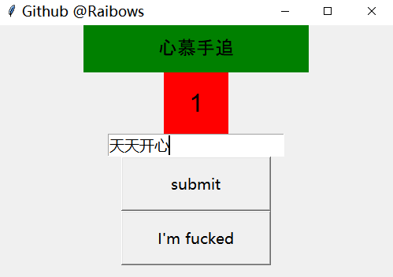

## Introduction
This a tiny python program which may help you 
learn python basic grammar.I mainly used tkinter and csv package. GUI sometimes is a good way to help you find interests in learning python ! And please **star** my project if you like it.
<div align="center">

</div>

## Getting Started
    1. chengyu.txt is the foundamental file that you have to load it first. But ver2 has already deleted it. It's too big for a tiny program.
    2. First, make sure your python version >= 3.6
    3. Then activate the python virtualvenv in scripts for windows. And for linux, advise you make a virtual environment through conda or virtualenv.
    4. Have fun, enjoy it !
```
virtualenv venv
Linux : source \bin\activate
Windows : \scripts\activate
pip3 install -r requirements.txt
python3 run.py
``` 
And I have packaged them into executable files on Windows(.exe) with pyinstaller. You could run run.exe just like run any other amd64exe programs.


## Feedback
If you have any problems or bug reports, you may propose a issue or <a href="Mailto:raibows@hotmail.com">contact </a> with me in email.

## Update Record Time
    1. ver1 March 26, 2019
    2. ver2 June 27, 2019


